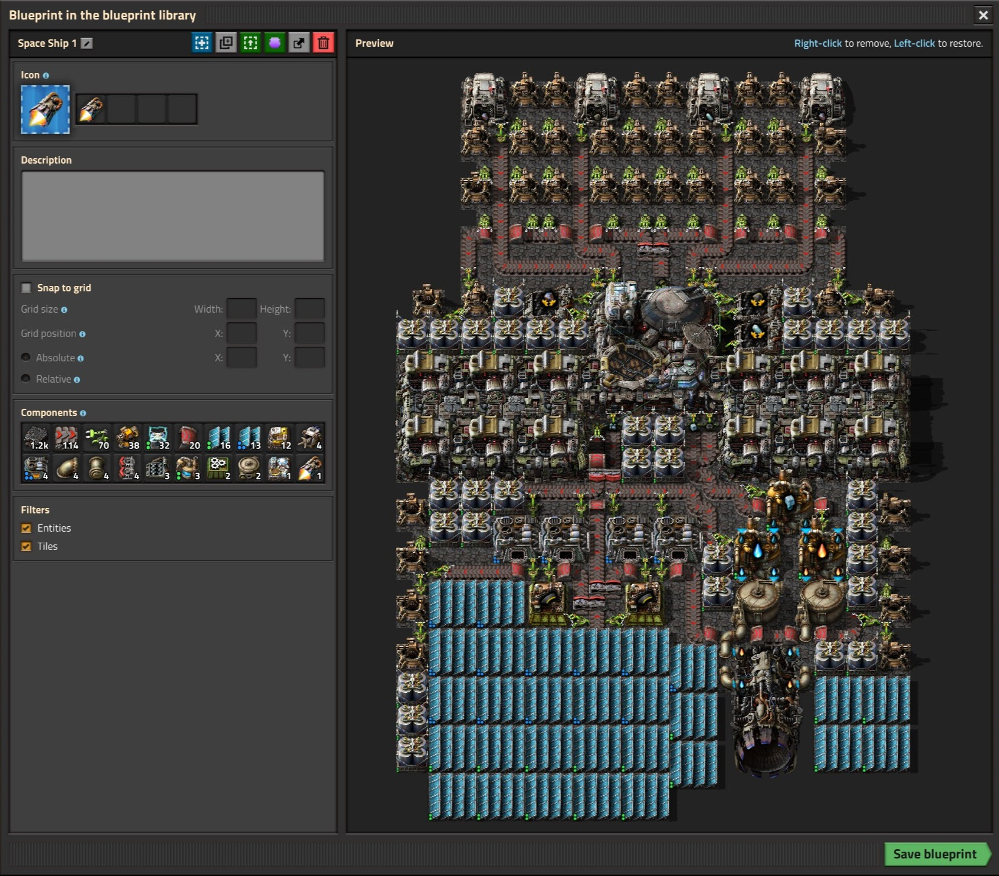
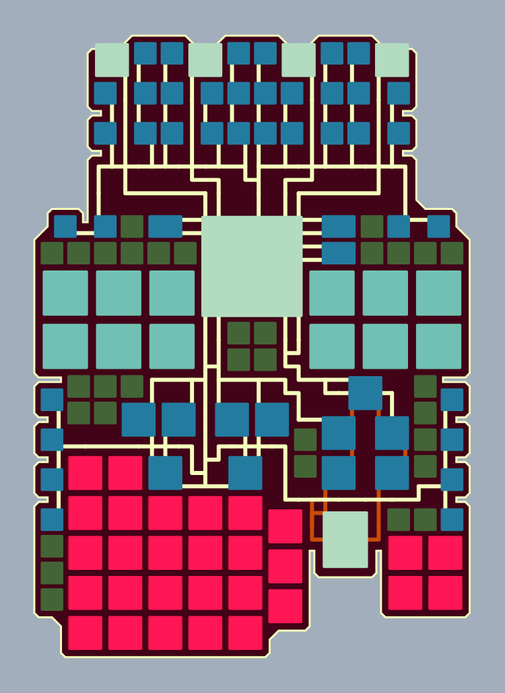
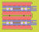
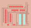
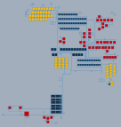
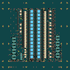
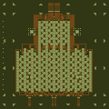
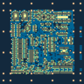
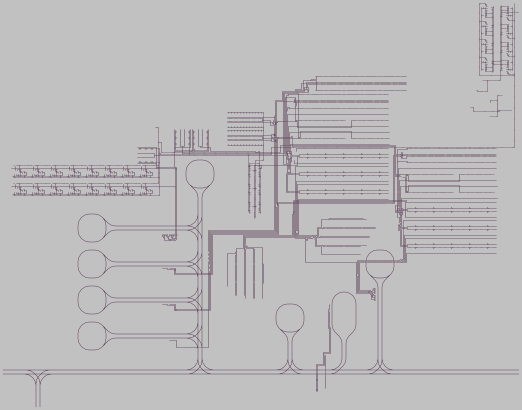

# Factorio Blueprint Visualizer

I love the game Factorio and I really like the look of factories after growing for many hours or blueprints after tweaking them for perfection. That's way I created a [website](https://piebro.github.io/factorio-blueprint-visualizer/) to artfully visualize Factorio blueprints.

With the website you can import Factorio blueprints as text and visualize them. You can tweak the drawing settings or create random ones.

All buildings and tiles with their bounding boxes and belt, pipe, rail, inserter, wire and electricity connections can be visualized. Everything is drawn in vector graphics (SVG) to be able to view it in any resolution. 

With the latest update, Blueprints from Factorio before version 2.0 might not work correctly. You can import older blueprints to factorio and export them again to update them.

## Usage

1. Open Factorio and create a blueprint.
2. Export the blueprint as text (in the upper left corner, next to the "Delete" button).
3. Go to the [website](https://piebro.github.io/factorio-blueprint-visualizer/).
4. Click the "Upload Blueprint" button and paste the text into the text area.
5. Now you can test new random drawing settings (using the buttons or the arrow keys) or edit the current drawing settings.

Documentation of the drawing settings can be found [here](drawing_settings_documentation.md).

## Examples

The last three blueprints are by Josh Ventura and can be found [here](https://factorioprints.com/user/6QrnfqXIffQcWgHC6Xs4uHv1BGg2).

## Update [2025-01-08]

- Factorio 2.0 and Factorio: Space Age are supported (Blueprints from earlier version might only work partially)
- Ported everything from Python to Javascript for simplicity and performance.
- Added ability to modify drawing settings.
- Added support for tiles.
- Lots of quality-of-life improvements.

## Ways to use this tool

### Text to Image

I created a [dataset](https://huggingface.co/datasets/piebro/factorio-blueprint-visualizations) with images generated using this tool to finetune [SDXL](https://huggingface.co/stabilityai/stable-diffusion-xl-base-1.0) (a text-to-image neural network). The model with examples can be found here: https://huggingface.co/piebro/factorio-blueprint-visualizations-sdxl-lora

### Pen Plotting

I have a pen plotter, and one of my initial ideas was also to be able to plot my factories. You can create visualizations you can easily draw. I recommend using https://github.com/abey79/vpype for merging lines together before plotting. An example of a visualization for plotting is here:

    

Another way to create plots from your factories is to use: https://github.com/drawscape-labs/factorio-cli.

## Factorio Tools to create blueprints

- [Factorio SAT](https://github.com/R-O-C-K-E-T/Factorio-SAT) - Create optimal belt layouts with a SAT solver
- [Factorio Verilog](https://github.com/redcrafter/verilog2factorio) - Convert Verilog code to factorio blueprints

## Development

[uv](https://docs.astral.sh/uv/getting-started/installation/) is used for linting and formatting the python code with `uv run ruff check --fix` and `uv run ruff format`.

## Contribute

Contributions to this project are welcome. Feel free to report bugs or post ideas.

## Statistics

There is lightweight tracking with [Plausible](https://plausible.io/about) for the [website](https://piebro.github.io/factorio-blueprint-visualizer/) to get infos about how many people are visiting. Everyone who is interested can look at these stats here: https://plausible.io/piebro.github.io%2Ffactorio-blueprint-visualizer?period=all
