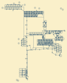
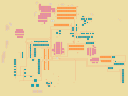

# Factorio Blueprint Visualizer
<p align="center">
    
</p>

I love the game Factorio and I really like the look of factories after growing for many hours or blueprints after tweaking them for perfection. So I thought about visualizing the factories and blueprints.

The hardest part was writing the logic for connecting rails, belts and pipes. After many failed attempts with lots of bugs, I wrote a system that works pretty well. The next step was, to be able to be creative with drawing different connections and bounding boxes of buildings. Therefor, I created configurable drawing settings to experiment with and a random draw settings generator. After some tweaking, I got nice visualizations. To make the visualization tool easily accessible, I created a small website that uses the original python code with [pyodide](https://github.com/pyodide/pyodide) in the browser (that's why the website might take some time to load) and an easy-to-use notebook.

## Usage

You can visualize your own blueprint with random drawing settings at: [https://piebro.github.io/factorio-blueprint-visualizer](https://piebro.github.io/factorio-blueprint-visualizer/) (You can use the arrow keys for going through the visualization). You can use the notebook, if you want to create your own drawing settings or tinker some more. For an easy setup, you can open the example notebook in -colab- or -binder-. You can find many blueprints from other people at: https://factorioprints.com.

## Examples

<p align="center">





</p>

These awesome blueprints are by Josh Ventura and can be found [here](https://factorioprints.com/user/6QrnfqXIffQcWgHC6Xs4uHv1BGg2).

## Contribute

If you create some cool blueprints and want to share them, you can add an issue in GitHub with the SVG and the blueprint link for others to enjoy and experiment with.

## Other

I also have a pen plotter, and one of my initial ideas was also to be able to plot my factories. The 5th example is made with pen plotting in mind, and some other drawing settings can be used to create plottable factories.

To easily convert all SVGs in a folder, you can use your terminal and Inkscape like this.
```mkdir pngs; for f in *.svg; do inkscape -w 1000 "$f" -e "pngs/${f::-3}png"; done```
