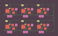

# Factorio Blueprint Visualizer
<p align="center">
    
</p>

I love the game Factorio and I really like the look of factories after growing for many hours or blueprints after tweaking them for perfection. So I thought about visualizing the factories and blueprints.

All factorio buildings with their bounding boxes and belt, pipe, inserter, wire and electricity connections can be visualized. Everything is drawn in vector graphics (SVG) to be able to view it in any resolution.

The hardest part was writing the logic for connecting rails, belts and pipes. After many failed attempts with lots of bugs, I wrote a system that works pretty well. The next step was, to be able to be creative with drawing different connections and bounding boxes of buildings. Therefor, I created configurable drawing settings to experiment with and a random draw settings generator. After some tweaking, I got nice visualizations. To make the visualization tool easily accessible, I created an [online demo](https://piebro.github.io/factorio-blueprint-visualizer/) that uses the original python code with [pyodide](https://github.com/pyodide/pyodide) in the browser (that's why the website might take some time to load) and an easy-to-use notebook.


## Examples

<p align="center">


</p>

The last three blueprints are by Josh Ventura and can be found [here](https://factorioprints.com/user/6QrnfqXIffQcWgHC6Xs4uHv1BGg2).

## Usage

You can visualize your own blueprint with random drawing settings at: [https://piebro.github.io/factorio-blueprint-visualizer](https://piebro.github.io/factorio-blueprint-visualizer/) (You can use the arrow keys for going through the visualization). You can use the notebook, if you want to create your own drawing settings or tinker some more. For an easy setup, you can open the example notebook in [colab](https://colab.research.google.com/github/piebro/factorio-blueprint-visualizer/blob/master/notebook.ipynb) or [binder](https://mybinder.org/v2/gh/piebro/factorio-blueprint-visualizer/HEAD?labpath=notebook.ipynb). You can find many blueprints at: https://www.factorio.school.
You can also use show factorio.school blueprints directly by adding `?source=factorio-school-blueprint-url` to the URL (e.g. https://piebro.github.io/factorio-blueprint-visualizer?source=https://www.factorio.school/view/-Mh4rtNMEm3CnDkTRc69)

[](https://colab.research.google.com/github/piebro/factorio-blueprint-visualizer/blob/master/notebook.ipynb)
[](https://mybinder.org/v2/gh/piebro/factorio-blueprint-visualizer/HEAD?labpath=notebook.ipynb)

### Drawing Settings

To visualize a blueprint you need drawing settings that define what is drawn, in which order and in what kind of style. Drawing settings are a list of option that are executed one after the other. You can decide which bounding box to draw with an allow or deny list of building names. You can also draw connected `belt`, `underground-belts`, `pipes`, `underground-pipes`, `inserter`, `rail`, `electricity`, `red-circuits` and `green-circuits`.

Furthermore, you can define the style of each drawing command or set a new default drawing style. You can use `fill`, `stroke`, `stroke-width`, `stroke-linecap`, `stroke-opacity`, `fill-opacity`, `bbox-scale`, `bbox-rx` and `bbox-ry` as properties and every SVG tag should also work.

Every visualization has the used drawing settings and blueprint saved with it, so you can check out the drawing settings of the examples blueprints inspiration.

### Text to Image

I created a [dataset](https://huggingface.co/datasets/piebro/factorio-blueprint-visualizations) with images generated using this tool to finetune [SDXL](https://huggingface.co/stabilityai/stable-diffusion-xl-base-1.0) (a text-to-image neural network). The model with examples can be found here: https://huggingface.co/piebro/factorio-blueprint-visualizations-sdxl-lora

### Pen Plotting

I have a pen plotter, and one of my initial ideas was also to be able to plot my factories. You can create visualizations you can easily draw. I recommend using https://github.com/abey79/vpype for merging lines together before plotting. An example of a visualization for plotting is here:

<p align="center">
    
</p>

Another way to create plots from your factories is to use: https://github.com/drawscape-labs/factorio-cli.

### verilog2factorio

It's possible to use https://github.com/redcrafter/verilog2factorio to create factorio verilog blueprints and visualize the buildings and wire connections like this.

<p align="center">
    
</p>

### Convert to PNGs

To easily convert all SVGs in a folder, you can use a terminal and Inkscape like this.
```mkdir pngs; for f in *.svg; do inkscape -w 1000 "$f" -e "pngs/${f::-3}png"; done```

## Contribute

Contributions to this project are welcome. Feel free to report bugs or post ideas.

To update the python code for the website, you have to update the python wheel in the website folder. To update it, just run: ```python setup.py bdist_wheel --universal --dist-dir=website```

To update the installed version while developing you can use ```python setup.py bdist_wheel --universal --dist-dir=website && pip uninstall factorioBlueprintVisualizer -y && pip install website/factorioBlueprintVisualizer-1.1.0-py2.py3-none-any.whl```

If you use an external api on localhost (e.g. for getting the blueprint from factorio.school) you need to disable CORS. To start Chrome on Ubuntu with CORS disable you can use ```google-chrome --disable-web-security --user-data-dir=temp http://0.0.0.0:8000/```.

## Statistics

There is lightweight tracking with [Plausible](https://plausible.io/about) for the [website](https://piebro.github.io/factorio-blueprint-visualizer/) to get infos about how many people are visiting. Everyone who is interested can look at these stats here: https://plausible.io/piebro.github.io%2Ffactorio-blueprint-visualizer?period=all